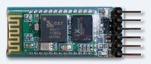
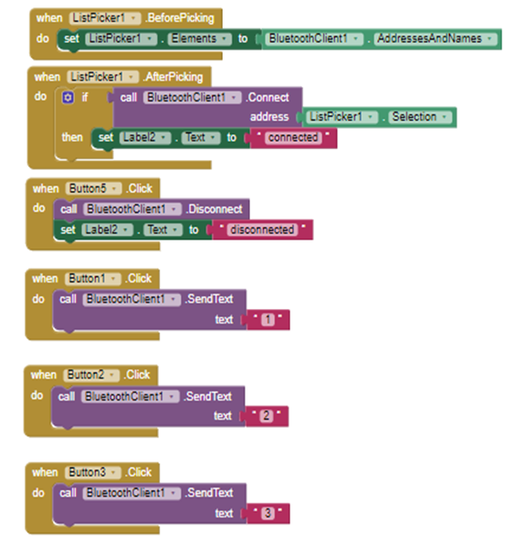

<html xmlns:v="urn:schemas-microsoft-com:vml"
xmlns:o="urn:schemas-microsoft-com:office:office"
xmlns:w="urn:schemas-microsoft-com:office:word"
xmlns:m="http://schemas.microsoft.com/office/2004/12/omml"
xmlns="http://www.w3.org/TR/REC-html40">

<head>
<meta http-equiv=Content-Type content="text/html; charset=windows-1252">
<meta name=ProgId content=Word.Document>
<meta name=Generator content="Microsoft Word 15">
<meta name=Originator content="Microsoft Word 15">
<link rel=File-List href="IBM-mini_project_files/filelist.xml">
<link rel=Preview href="IBM-mini_project_files/preview.wmf">
<link rel=Edit-Time-Data href="IBM-mini_project_files/editdata.mso">
<!--[if !mso]>

<![endif]-->
<title>Natural Disaster Management System using IBM Bluemix</title>
<!--[if gte mso 9]><xml>
 <o:DocumentProperties>
  <o:Author>Jeremy Sam Joseph</o:Author>
  <o:Keywords>IBM Bluemix;Node-Red;Natural Disaster;Call for Code</o:Keywords>
  <o:LastAuthor>Jeremy Sam Joseph</o:LastAuthor>
  <o:Revision>2</o:Revision>
  <o:TotalTime>40</o:TotalTime>
  <o:Created>2018-12-28T04:43:00Z</o:Created>
  <o:LastSaved>2018-12-28T04:43:00Z</o:LastSaved>
  <o:Pages>16</o:Pages>
  <o:Words>2309</o:Words>
  <o:Characters>13166</o:Characters>
  <o:Lines>109</o:Lines>
  <o:Paragraphs>30</o:Paragraphs>
  <o:CharactersWithSpaces>15445</o:CharactersWithSpaces>
  <o:Version>16.00</o:Version>
 </o:DocumentProperties>
 <o:OfficeDocumentSettings>
  <o:AllowPNG/>
 </o:OfficeDocumentSettings>
</xml><![endif]-->
<link rel=dataStoreItem href="IBM-mini_project_files/item0001.xml"
target="IBM-mini_project_files/props002.xml">
<link rel=themeData href="IBM-mini_project_files/themedata.thmx">
<link rel=colorSchemeMapping
href="IBM-mini_project_files/colorschememapping.xml">
<!--[if gte mso 9]><xml>
 <w:WordDocument>
  <w:SpellingState>Clean</w:SpellingState>
  <w:GrammarState>Clean</w:GrammarState>
  <w:TrackMoves>false</w:TrackMoves>
  <w:TrackFormatting/>
  <w:PunctuationKerning/>
  <w:ValidateAgainstSchemas/>
  <w:SaveIfXMLInvalid>false</w:SaveIfXMLInvalid>
  <w:IgnoreMixedContent>false</w:IgnoreMixedContent>
  <w:AlwaysShowPlaceholderText>false</w:AlwaysShowPlaceholderText>
  <w:DoNotPromoteQF/>
  <w:LidThemeOther>EN-IN</w:LidThemeOther>
  <w:LidThemeAsian>X-NONE</w:LidThemeAsian>
  <w:LidThemeComplexScript>X-NONE</w:LidThemeComplexScript>
  <w:Compatibility>
   <w:BreakWrappedTables/>
   <w:SnapToGridInCell/>
   <w:WrapTextWithPunct/>
   <w:UseAsianBreakRules/>
   <w:DontGrowAutofit/>
   <w:SplitPgBreakAndParaMark/>
   <w:EnableOpenTypeKerning/>
   <w:DontFlipMirrorIndents/>
   <w:OverrideTableStyleHps/>
  </w:Compatibility>
  <m:mathPr>
   <m:mathFont m:val="Cambria Math"/>
   <m:brkBin m:val="before"/>
   <m:brkBinSub m:val="&#45;-"/>
   <m:smallFrac m:val="off"/>
   <m:dispDef/>
   <m:lMargin m:val="0"/>
   <m:rMargin m:val="0"/>
   <m:defJc m:val="centerGroup"/>
   <m:wrapIndent m:val="1440"/>
   <m:intLim m:val="subSup"/>
   <m:naryLim m:val="undOvr"/>
  </m:mathPr></w:WordDocument>
</xml><![endif]--><!--[if gte mso 9]><xml>
 <w:LatentStyles DefLockedState="false" DefUnhideWhenUsed="false"
  DefSemiHidden="false" DefQFormat="false" DefPriority="99"
  LatentStyleCount="375">
  <w:LsdException Locked="false" Priority="0" QFormat="true" Name="Normal"/>
  <w:LsdException Locked="false" Priority="9" QFormat="true" Name="heading 1"/>
  <w:LsdException Locked="false" Priority="9" SemiHidden="true"
   UnhideWhenUsed="true" QFormat="true" Name="heading 2"/>
  <w:LsdException Locked="false" Priority="9" SemiHidden="true"
   UnhideWhenUsed="true" QFormat="true" Name="heading 3"/>
  <w:LsdException Locked="false" Priority="9" SemiHidden="true"
   UnhideWhenUsed="true" QFormat="true" Name="heading 4"/>
  <w:LsdException Locked="false" Priority="9" SemiHidden="true"
   UnhideWhenUsed="true" QFormat="true" Name="heading 5"/>
  <w:LsdException Locked="false" Priority="9" SemiHidden="true"
   UnhideWhenUsed="true" QFormat="true" Name="heading 6"/>
  <w:LsdException Locked="false" Priority="9" SemiHidden="true"
   UnhideWhenUsed="true" QFormat="true" Name="heading 7"/>
  <w:LsdException Locked="false" Priority="9" SemiHidden="true"
   UnhideWhenUsed="true" QFormat="true" Name="heading 8"/>
  <w:LsdException Locked="false" Priority="9" SemiHidden="true"
   UnhideWhenUsed="true" QFormat="true" Name="heading 9"/>
  <w:LsdException Locked="false" SemiHidden="true" UnhideWhenUsed="true"
   Name="index 1"/>
  <w:LsdException Locked="false" SemiHidden="true" UnhideWhenUsed="true"
   Name="index 2"/>
  <w:LsdException Locked="false" SemiHidden="true" UnhideWhenUsed="true"
   Name="index 3"/>
  <w:LsdException Locked="false" SemiHidden="true" UnhideWhenUsed="true"
   Name="index 4"/>
  <w:LsdException Locked="false" SemiHidden="true" UnhideWhenUsed="true"
   Name="index 5"/>
  <w:LsdException Locked="false" SemiHidden="true" UnhideWhenUsed="true"
   Name="index 6"/>
  <w:LsdException Locked="false" SemiHidden="true" UnhideWhenUsed="true"
   Name="index 7"/>
  <w:LsdException Locked="false" SemiHidden="true" UnhideWhenUsed="true"
   Name="index 8"/>
  <w:LsdException Locked="false" SemiHidden="true" UnhideWhenUsed="true"
   Name="index 9"/>
  <w:LsdException Locked="false" Priority="39" SemiHidden="true"
   UnhideWhenUsed="true" Name="toc 1"/>
  <w:LsdException Locked="false" Priority="39" SemiHidden="true"
   UnhideWhenUsed="true" Name="toc 2"/>
  <w:LsdException Locked="false" Priority="39" SemiHidden="true"
   UnhideWhenUsed="true" Name="toc 3"/>
  <w:LsdException Locked="false" Priority="39" SemiHidden="true"
   UnhideWhenUsed="true" Name="toc 4"/>
  <w:LsdException Locked="false" Priority="39" SemiHidden="true"
   UnhideWhenUsed="true" Name="toc 5"/>
  <w:LsdException Locked="false" Priority="39" SemiHidden="true"
   UnhideWhenUsed="true" Name="toc 6"/>
  <w:LsdException Locked="false" Priority="39" SemiHidden="true"
   UnhideWhenUsed="true" Name="toc 7"/>
  <w:LsdException Locked="false" Priority="39" SemiHidden="true"
   UnhideWhenUsed="true" Name="toc 8"/>
  <w:LsdException Locked="false" Priority="39" SemiHidden="true"
   UnhideWhenUsed="true" Name="toc 9"/>
  <w:LsdException Locked="false" SemiHidden="true" UnhideWhenUsed="true"
   Name="Normal Indent"/>
  <w:LsdException Locked="false" SemiHidden="true" UnhideWhenUsed="true"
   Name="footnote text"/>
  <w:LsdException Locked="false" SemiHidden="true" UnhideWhenUsed="true"
   Name="annotation text"/>
  <w:LsdException Locked="false" SemiHidden="true" UnhideWhenUsed="true"
   Name="header"/>
  <w:LsdException Locked="false" SemiHidden="true" UnhideWhenUsed="true"
   Name="footer"/>
  <w:LsdException Locked="false" SemiHidden="true" UnhideWhenUsed="true"
   Name="index heading"/>
  <w:LsdException Locked="false" Priority="35" SemiHidden="true"
   UnhideWhenUsed="true" QFormat="true" Name="caption"/>
  <w:LsdException Locked="false" SemiHidden="true" UnhideWhenUsed="true"
   Name="table of figures"/>
  <w:LsdException Locked="false" SemiHidden="true" UnhideWhenUsed="true"
   Name="envelope address"/>
  <w:LsdException Locked="false" SemiHidden="true" UnhideWhenUsed="true"
   Name="envelope return"/>
  <w:LsdException Locked="false" SemiHidden="true" UnhideWhenUsed="true"
   Name="footnote reference"/>
  <w:LsdException Locked="false" SemiHidden="true" UnhideWhenUsed="true"
   Name="annotation reference"/>
  <w:LsdException Locked="false" SemiHidden="true" UnhideWhenUsed="true"
   Name="line number"/>
  <w:LsdException Locked="false" SemiHidden="true" UnhideWhenUsed="true"
   Name="page number"/>
  <w:LsdException Locked="false" SemiHidden="true" UnhideWhenUsed="true"
   Name="endnote reference"/>
  <w:LsdException Locked="false" SemiHidden="true" UnhideWhenUsed="true"
   Name="endnote text"/>
  <w:LsdException Locked="false" SemiHidden="true" UnhideWhenUsed="true"
   Name="table of authorities"/>
  <w:LsdException Locked="false" SemiHidden="true" UnhideWhenUsed="true"
   Name="macro"/>
  <w:LsdException Locked="false" SemiHidden="true" UnhideWhenUsed="true"
   Name="toa heading"/>
  <w:LsdException Locked="false" SemiHidden="true" UnhideWhenUsed="true"
   Name="List"/>
  <w:LsdException Locked="false" SemiHidden="true" UnhideWhenUsed="true"
   Name="List Bullet"/>
  <w:LsdException Locked="false" SemiHidden="true" UnhideWhenUsed="true"
   Name="List Number"/>
  <w:LsdException Locked="false" SemiHidden="true" UnhideWhenUsed="true"
   Name="List 2"/>
  <w:LsdException Locked="false" SemiHidden="true" UnhideWhenUsed="true"
   Name="List 3"/>
  <w:LsdException Locked="false" SemiHidden="true" UnhideWhenUsed="true"
   Name="List 4"/>
  <w:LsdException Locked="false" SemiHidden="true" UnhideWhenUsed="true"
   Name="List 5"/>
  <w:LsdException Locked="false" SemiHidden="true" UnhideWhenUsed="true"
   Name="List Bullet 2"/>
  <w:LsdException Locked="false" SemiHidden="true" UnhideWhenUsed="true"
   Name="List Bullet 3"/>
  <w:LsdException Locked="false" SemiHidden="true" UnhideWhenUsed="true"
   Name="List Bullet 4"/>
  <w:LsdException Locked="false" SemiHidden="true" UnhideWhenUsed="true"
   Name="List Bullet 5"/>
  <w:LsdException Locked="false" SemiHidden="true" UnhideWhenUsed="true"
   Name="List Number 2"/>
  <w:LsdException Locked="false" SemiHidden="true" UnhideWhenUsed="true"
   Name="List Number 3"/>
  <w:LsdException Locked="false" SemiHidden="true" UnhideWhenUsed="true"
   Name="List Number 4"/>
  <w:LsdException Locked="false" SemiHidden="true" UnhideWhenUsed="true"
   Name="List Number 5"/>
  <w:LsdException Locked="false" Priority="10" QFormat="true" Name="Title"/>
  <w:LsdException Locked="false" SemiHidden="true" UnhideWhenUsed="true"
   Name="Closing"/>
  <w:LsdException Locked="false" SemiHidden="true" UnhideWhenUsed="true"
   Name="Signature"/>
  <w:LsdException Locked="false" Priority="1" SemiHidden="true"
   UnhideWhenUsed="true" Name="Default Paragraph Font"/>
  <w:LsdException Locked="false" SemiHidden="true" UnhideWhenUsed="true"
   Name="Body Text"/>
  <w:LsdException Locked="false" SemiHidden="true" UnhideWhenUsed="true"
   Name="Body Text Indent"/>
  <w:LsdException Locked="false" SemiHidden="true" UnhideWhenUsed="true"
   Name="List Continue"/>
  <w:LsdException Locked="false" SemiHidden="true" UnhideWhenUsed="true"
   Name="List Continue 2"/>
  <w:LsdException Locked="false" SemiHidden="true" UnhideWhenUsed="true"
   Name="List Continue 3"/>
  <w:LsdException Locked="false" SemiHidden="true" UnhideWhenUsed="true"
   Name="List Continue 4"/>
  <w:LsdException Locked="false" SemiHidden="true" UnhideWhenUsed="true"
   Name="List Continue 5"/>
  <w:LsdException Locked="false" SemiHidden="true" UnhideWhenUsed="true"
   Name="Message Header"/>
  <w:LsdException Locked="false" Priority="11" QFormat="true" Name="Subtitle"/>
  <w:LsdException Locked="false" SemiHidden="true" UnhideWhenUsed="true"
   Name="Salutation"/>
  <w:LsdException Locked="false" SemiHidden="true" UnhideWhenUsed="true"
   Name="Date"/>
  <w:LsdException Locked="false" SemiHidden="true" UnhideWhenUsed="true"
   Name="Body Text First Indent"/>
  <w:LsdException Locked="false" SemiHidden="true" UnhideWhenUsed="true"
   Name="Body Text First Indent 2"/>
  <w:LsdException Locked="false" SemiHidden="true" UnhideWhenUsed="true"
   Name="Note Heading"/>
  <w:LsdException Locked="false" SemiHidden="true" UnhideWhenUsed="true"
   Name="Body Text 2"/>
  <w:LsdException Locked="false" SemiHidden="true" UnhideWhenUsed="true"
   Name="Body Text 3"/>
  <w:LsdException Locked="false" SemiHidden="true" UnhideWhenUsed="true"
   Name="Body Text Indent 2"/>
  <w:LsdException Locked="false" SemiHidden="true" UnhideWhenUsed="true"
   Name="Body Text Indent 3"/>
  <w:LsdException Locked="false" SemiHidden="true" UnhideWhenUsed="true"
   Name="Block Text"/>
  <w:LsdException Locked="false" SemiHidden="true" UnhideWhenUsed="true"
   Name="Hyperlink"/>
  <w:LsdException Locked="false" SemiHidden="true" UnhideWhenUsed="true"
   Name="FollowedHyperlink"/>
  <w:LsdException Locked="false" Priority="22" QFormat="true" Name="Strong"/>
  <w:LsdException Locked="false" Priority="20" QFormat="true" Name="Emphasis"/>
  <w:LsdException Locked="false" SemiHidden="true" UnhideWhenUsed="true"
   Name="Document Map"/>
  <w:LsdException Locked="false" SemiHidden="true" UnhideWhenUsed="true"
   Name="Plain Text"/>
  <w:LsdException Locked="false" SemiHidden="true" UnhideWhenUsed="true"
   Name="E-mail Signature"/>
  <w:LsdException Locked="false" SemiHidden="true" UnhideWhenUsed="true"
   Name="HTML Top of Form"/>
  <w:LsdException Locked="false" SemiHidden="true" UnhideWhenUsed="true"
   Name="HTML Bottom of Form"/>
  <w:LsdException Locked="false" SemiHidden="true" UnhideWhenUsed="true"
   Name="Normal (Web)"/>
  <w:LsdException Locked="false" SemiHidden="true" UnhideWhenUsed="true"
   Name="HTML Acronym"/>
  <w:LsdException Locked="false" SemiHidden="true" UnhideWhenUsed="true"
   Name="HTML Address"/>
  <w:LsdException Locked="false" SemiHidden="true" UnhideWhenUsed="true"
   Name="HTML Cite"/>
  <w:LsdException Locked="false" SemiHidden="true" UnhideWhenUsed="true"
   Name="HTML Code"/>
  <w:LsdException Locked="false" SemiHidden="true" UnhideWhenUsed="true"
   Name="HTML Definition"/>
  <w:LsdException Locked="false" SemiHidden="true" UnhideWhenUsed="true"
   Name="HTML Keyboard"/>
  <w:LsdException Locked="false" SemiHidden="true" UnhideWhenUsed="true"
   Name="HTML Preformatted"/>
  <w:LsdException Locked="false" SemiHidden="true" UnhideWhenUsed="true"
   Name="HTML Sample"/>
  <w:LsdException Locked="false" SemiHidden="true" UnhideWhenUsed="true"
   Name="HTML Typewriter"/>
  <w:LsdException Locked="false" SemiHidden="true" UnhideWhenUsed="true"
   Name="HTML Variable"/>
  <w:LsdException Locked="false" SemiHidden="true" UnhideWhenUsed="true"
   Name="Normal Table"/>
  <w:LsdException Locked="false" SemiHidden="true" UnhideWhenUsed="true"
   Name="annotation subject"/>
  <w:LsdException Locked="false" SemiHidden="true" UnhideWhenUsed="true"
   Name="No List"/>
  <w:LsdException Locked="false" SemiHidden="true" UnhideWhenUsed="true"
   Name="Outline List 1"/>
  <w:LsdException Locked="false" SemiHidden="true" UnhideWhenUsed="true"
   Name="Outline List 2"/>
  <w:LsdException Locked="false" SemiHidden="true" UnhideWhenUsed="true"
   Name="Outline List 3"/>
  <w:LsdException Locked="false" SemiHidden="true" UnhideWhenUsed="true"
   Name="Table Simple 1"/>
  <w:LsdException Locked="false" SemiHidden="true" UnhideWhenUsed="true"
   Name="Table Simple 2"/>
  <w:LsdException Locked="false" SemiHidden="true" UnhideWhenUsed="true"
   Name="Table Simple 3"/>
  <w:LsdException Locked="false" SemiHidden="true" UnhideWhenUsed="true"
   Name="Table Classic 1"/>
  <w:LsdException Locked="false" SemiHidden="true" UnhideWhenUsed="true"
   Name="Table Classic 2"/>
  <w:LsdException Locked="false" SemiHidden="true" UnhideWhenUsed="true"
   Name="Table Classic 3"/>
  <w:LsdException Locked="false" SemiHidden="true" UnhideWhenUsed="true"
   Name="Table Classic 4"/>
  <w:LsdException Locked="false" SemiHidden="true" UnhideWhenUsed="true"
   Name="Table Colorful 1"/>
  <w:LsdException Locked="false" SemiHidden="true" UnhideWhenUsed="true"
   Name="Table Colorful 2"/>
  <w:LsdException Locked="false" SemiHidden="true" UnhideWhenUsed="true"
   Name="Table Colorful 3"/>
  <w:LsdException Locked="false" SemiHidden="true" UnhideWhenUsed="true"
   Name="Table Columns 1"/>
  <w:LsdException Locked="false" SemiHidden="true" UnhideWhenUsed="true"
   Name="Table Columns 2"/>
  <w:LsdException Locked="false" SemiHidden="true" UnhideWhenUsed="true"
   Name="Table Columns 3"/>
  <w:LsdException Locked="false" SemiHidden="true" UnhideWhenUsed="true"
   Name="Table Columns 4"/>
  <w:LsdException Locked="false" SemiHidden="true" UnhideWhenUsed="true"
   Name="Table Columns 5"/>
  <w:LsdException Locked="false" SemiHidden="true" UnhideWhenUsed="true"
   Name="Table Grid 1"/>
  <w:LsdException Locked="false" SemiHidden="true" UnhideWhenUsed="true"
   Name="Table Grid 2"/>
  <w:LsdException Locked="false" SemiHidden="true" UnhideWhenUsed="true"
   Name="Table Grid 3"/>
  <w:LsdException Locked="false" SemiHidden="true" UnhideWhenUsed="true"
   Name="Table Grid 4"/>
  <w:LsdException Locked="false" SemiHidden="true" UnhideWhenUsed="true"
   Name="Table Grid 5"/>
  <w:LsdException Locked="false" SemiHidden="true" UnhideWhenUsed="true"
   Name="Table Grid 6"/>
  <w:LsdException Locked="false" SemiHidden="true" UnhideWhenUsed="true"
   Name="Table Grid 7"/>
  <w:LsdException Locked="false" SemiHidden="true" UnhideWhenUsed="true"
   Name="Table Grid 8"/>
  <w:LsdException Locked="false" SemiHidden="true" UnhideWhenUsed="true"
   Name="Table List 1"/>
  <w:LsdException Locked="false" SemiHidden="true" UnhideWhenUsed="true"
   Name="Table List 2"/>
  <w:LsdException Locked="false" SemiHidden="true" UnhideWhenUsed="true"
   Name="Table List 3"/>
  <w:LsdException Locked="false" SemiHidden="true" UnhideWhenUsed="true"
   Name="Table List 4"/>
  <w:LsdException Locked="false" SemiHidden="true" UnhideWhenUsed="true"
   Name="Table List 5"/>
  <w:LsdException Locked="false" SemiHidden="true" UnhideWhenUsed="true"
   Name="Table List 6"/>
  <w:LsdException Locked="false" SemiHidden="true" UnhideWhenUsed="true"
   Name="Table List 7"/>
  <w:LsdException Locked="false" SemiHidden="true" UnhideWhenUsed="true"
   Name="Table List 8"/>
  <w:LsdException Locked="false" SemiHidden="true" UnhideWhenUsed="true"
   Name="Table 3D effects 1"/>
  <w:LsdException Locked="false" SemiHidden="true" UnhideWhenUsed="true"
   Name="Table 3D effects 2"/>
  <w:LsdException Locked="false" SemiHidden="true" UnhideWhenUsed="true"
   Name="Table 3D effects 3"/>
  <w:LsdException Locked="false" SemiHidden="true" UnhideWhenUsed="true"
   Name="Table Contemporary"/>
  <w:LsdException Locked="false" SemiHidden="true" UnhideWhenUsed="true"
   Name="Table Elegant"/>
  <w:LsdException Locked="false" SemiHidden="true" UnhideWhenUsed="true"
   Name="Table Professional"/>
  <w:LsdException Locked="false" SemiHidden="true" UnhideWhenUsed="true"
   Name="Table Subtle 1"/>
  <w:LsdException Locked="false" SemiHidden="true" UnhideWhenUsed="true"
   Name="Table Subtle 2"/>
  <w:LsdException Locked="false" SemiHidden="true" UnhideWhenUsed="true"
   Name="Table Web 1"/>
  <w:LsdException Locked="false" SemiHidden="true" UnhideWhenUsed="true"
   Name="Table Web 2"/>
  <w:LsdException Locked="false" SemiHidden="true" UnhideWhenUsed="true"
   Name="Table Web 3"/>
  <w:LsdException Locked="false" SemiHidden="true" UnhideWhenUsed="true"
   Name="Balloon Text"/>
  <w:LsdException Locked="false" Priority="39" Name="Table Grid"/>
  <w:LsdException Locked="false" SemiHidden="true" UnhideWhenUsed="true"
   Name="Table Theme"/>
  <w:LsdException Locked="false" SemiHidden="true" Name="Placeholder Text"/>
  <w:LsdException Locked="false" Priority="1" QFormat="true" Name="No Spacing"/>
  <w:LsdException Locked="false" Priority="60" Name="Light Shading"/>
  <w:LsdException Locked="false" Priority="61" Name="Light List"/>
  <w:LsdException Locked="false" Priority="62" Name="Light Grid"/>
  <w:LsdException Locked="false" Priority="63" Name="Medium Shading 1"/>
  <w:LsdException Locked="false" Priority="64" Name="Medium Shading 2"/>
  <w:LsdException Locked="false" Priority="65" Name="Medium List 1"/>
  <w:LsdException Locked="false" Priority="66" Name="Medium List 2"/>
  <w:LsdException Locked="false" Priority="67" Name="Medium Grid 1"/>
  <w:LsdException Locked="false" Priority="68" Name="Medium Grid 2"/>
  <w:LsdException Locked="false" Priority="69" Name="Medium Grid 3"/>
  <w:LsdException Locked="false" Priority="70" Name="Dark List"/>
  <w:LsdException Locked="false" Priority="71" Name="Colorful Shading"/>
  <w:LsdException Locked="false" Priority="72" Name="Colorful List"/>
  <w:LsdException Locked="false" Priority="73" Name="Colorful Grid"/>
  <w:LsdException Locked="false" Priority="60" Name="Light Shading Accent 1"/>
  <w:LsdException Locked="false" Priority="61" Name="Light List Accent 1"/>
  <w:LsdException Locked="false" Priority="62" Name="Light Grid Accent 1"/>
  <w:LsdException Locked="false" Priority="63" Name="Medium Shading 1 Accent 1"/>
  <w:LsdException Locked="false" Priority="64" Name="Medium Shading 2 Accent 1"/>
  <w:LsdException Locked="false" Priority="65" Name="Medium List 1 Accent 1"/>
  <w:LsdException Locked="false" SemiHidden="true" Name="Revision"/>
  <w:LsdException Locked="false" Priority="34" QFormat="true"
   Name="List Paragraph"/>
  <w:LsdException Locked="false" Priority="29" QFormat="true" Name="Quote"/>
  <w:LsdException Locked="false" Priority="30" QFormat="true"
   Name="Intense Quote"/>
  <w:LsdException Locked="false" Priority="66" Name="Medium List 2 Accent 1"/>
  <w:LsdException Locked="false" Priority="67" Name="Medium Grid 1 Accent 1"/>
  <w:LsdException Locked="false" Priority="68" Name="Medium Grid 2 Accent 1"/>
  <w:LsdException Locked="false" Priority="69" Name="Medium Grid 3 Accent 1"/>
  <w:LsdException Locked="false" Priority="70" Name="Dark List Accent 1"/>
  <w:LsdException Locked="false" Priority="71" Name="Colorful Shading Accent 1"/>
  <w:LsdException Locked="false" Priority="72" Name="Colorful List Accent 1"/>
  <w:LsdException Locked="false" Priority="73" Name="Colorful Grid Accent 1"/>
  <w:LsdException Locked="false" Priority="60" Name="Light Shading Accent 2"/>
  <w:LsdException Locked="false" Priority="61" Name="Light List Accent 2"/>
  <w:LsdException Locked="false" Priority="62" Name="Light Grid Accent 2"/>
  <w:LsdException Locked="false" Priority="63" Name="Medium Shading 1 Accent 2"/>
  <w:LsdException Locked="false" Priority="64" Name="Medium Shading 2 Accent 2"/>
  <w:LsdException Locked="false" Priority="65" Name="Medium List 1 Accent 2"/>
  <w:LsdException Locked="false" Priority="66" Name="Medium List 2 Accent 2"/>
  <w:LsdException Locked="false" Priority="67" Name="Medium Grid 1 Accent 2"/>
  <w:LsdException Locked="false" Priority="68" Name="Medium Grid 2 Accent 2"/>
  <w:LsdException Locked="false" Priority="69" Name="Medium Grid 3 Accent 2"/>
  <w:LsdException Locked="false" Priority="70" Name="Dark List Accent 2"/>
  <w:LsdException Locked="false" Priority="71" Name="Colorful Shading Accent 2"/>
  <w:LsdException Locked="false" Priority="72" Name="Colorful List Accent 2"/>
  <w:LsdException Locked="false" Priority="73" Name="Colorful Grid Accent 2"/>
  <w:LsdException Locked="false" Priority="60" Name="Light Shading Accent 3"/>
  <w:LsdException Locked="false" Priority="61" Name="Light List Accent 3"/>
  <w:LsdException Locked="false" Priority="62" Name="Light Grid Accent 3"/>
  <w:LsdException Locked="false" Priority="63" Name="Medium Shading 1 Accent 3"/>
  <w:LsdException Locked="false" Priority="64" Name="Medium Shading 2 Accent 3"/>
  <w:LsdException Locked="false" Priority="65" Name="Medium List 1 Accent 3"/>
  <w:LsdException Locked="false" Priority="66" Name="Medium List 2 Accent 3"/>
  <w:LsdException Locked="false" Priority="67" Name="Medium Grid 1 Accent 3"/>
  <w:LsdException Locked="false" Priority="68" Name="Medium Grid 2 Accent 3"/>
  <w:LsdException Locked="false" Priority="69" Name="Medium Grid 3 Accent 3"/>
  <w:LsdException Locked="false" Priority="70" Name="Dark List Accent 3"/>
  <w:LsdException Locked="false" Priority="71" Name="Colorful Shading Accent 3"/>
  <w:LsdException Locked="false" Priority="72" Name="Colorful List Accent 3"/>
  <w:LsdException Locked="false" Priority="73" Name="Colorful Grid Accent 3"/>
  <w:LsdException Locked="false" Priority="60" Name="Light Shading Accent 4"/>
  <w:LsdException Locked="false" Priority="61" Name="Light List Accent 4"/>
  <w:LsdException Locked="false" Priority="62" Name="Light Grid Accent 4"/>
  <w:LsdException Locked="false" Priority="63" Name="Medium Shading 1 Accent 4"/>
  <w:LsdException Locked="false" Priority="64" Name="Medium Shading 2 Accent 4"/>
  <w:LsdException Locked="false" Priority="65" Name="Medium List 1 Accent 4"/>
  <w:LsdException Locked="false" Priority="66" Name="Medium List 2 Accent 4"/>
  <w:LsdException Locked="false" Priority="67" Name="Medium Grid 1 Accent 4"/>
  <w:LsdException Locked="false" Priority="68" Name="Medium Grid 2 Accent 4"/>
  <w:LsdException Locked="false" Priority="69" Name="Medium Grid 3 Accent 4"/>
  <w:LsdException Locked="false" Priority="70" Name="Dark List Accent 4"/>
  <w:LsdException Locked="false" Priority="71" Name="Colorful Shading Accent 4"/>
  <w:LsdException Locked="false" Priority="72" Name="Colorful List Accent 4"/>
  <w:LsdException Locked="false" Priority="73" Name="Colorful Grid Accent 4"/>
  <w:LsdException Locked="false" Priority="60" Name="Light Shading Accent 5"/>
  <w:LsdException Locked="false" Priority="61" Name="Light List Accent 5"/>
  <w:LsdException Locked="false" Priority="62" Name="Light Grid Accent 5"/>
  <w:LsdException Locked="false" Priority="63" Name="Medium Shading 1 Accent 5"/>
  <w:LsdException Locked="false" Priority="64" Name="Medium Shading 2 Accent 5"/>
  <w:LsdException Locked="false" Priority="65" Name="Medium List 1 Accent 5"/>
  <w:LsdException Locked="false" Priority="66" Name="Medium List 2 Accent 5"/>
  <w:LsdException Locked="false" Priority="67" Name="Medium Grid 1 Accent 5"/>
  <w:LsdException Locked="false" Priority="68" Name="Medium Grid 2 Accent 5"/>
  <w:LsdException Locked="false" Priority="69" Name="Medium Grid 3 Accent 5"/>
  <w:LsdException Locked="false" Priority="70" Name="Dark List Accent 5"/>
  <w:LsdException Locked="false" Priority="71" Name="Colorful Shading Accent 5"/>
  <w:LsdException Locked="false" Priority="72" Name="Colorful List Accent 5"/>
  <w:LsdException Locked="false" Priority="73" Name="Colorful Grid Accent 5"/>
  <w:LsdException Locked="false" Priority="60" Name="Light Shading Accent 6"/>
  <w:LsdException Locked="false" Priority="61" Name="Light List Accent 6"/>
  <w:LsdException Locked="false" Priority="62" Name="Light Grid Accent 6"/>
  <w:LsdException Locked="false" Priority="63" Name="Medium Shading 1 Accent 6"/>
  <w:LsdException Locked="false" Priority="64" Name="Medium Shading 2 Accent 6"/>
  <w:LsdException Locked="false" Priority="65" Name="Medium List 1 Accent 6"/>
  <w:LsdException Locked="false" Priority="66" Name="Medium List 2 Accent 6"/>
  <w:LsdException Locked="false" Priority="67" Name="Medium Grid 1 Accent 6"/>
  <w:LsdException Locked="false" Priority="68" Name="Medium Grid 2 Accent 6"/>
  <w:LsdException Locked="false" Priority="69" Name="Medium Grid 3 Accent 6"/>
  <w:LsdException Locked="false" Priority="70" Name="Dark List Accent 6"/>
  <w:LsdException Locked="false" Priority="71" Name="Colorful Shading Accent 6"/>
  <w:LsdException Locked="false" Priority="72" Name="Colorful List Accent 6"/>
  <w:LsdException Locked="false" Priority="73" Name="Colorful Grid Accent 6"/>
  <w:LsdException Locked="false" Priority="19" QFormat="true"
   Name="Subtle Emphasis"/>
  <w:LsdException Locked="false" Priority="21" QFormat="true"
   Name="Intense Emphasis"/>
  <w:LsdException Locked="false" Priority="31" QFormat="true"
   Name="Subtle Reference"/>
  <w:LsdException Locked="false" Priority="32" QFormat="true"
   Name="Intense Reference"/>
  <w:LsdException Locked="false" Priority="33" QFormat="true" Name="Book Title"/>
  <w:LsdException Locked="false" Priority="37" SemiHidden="true"
   UnhideWhenUsed="true" Name="Bibliography"/>
  <w:LsdException Locked="false" Priority="39" SemiHidden="true"
   UnhideWhenUsed="true" QFormat="true" Name="TOC Heading"/>
  <w:LsdException Locked="false" Priority="41" Name="Plain Table 1"/>
  <w:LsdException Locked="false" Priority="42" Name="Plain Table 2"/>
  <w:LsdException Locked="false" Priority="43" Name="Plain Table 3"/>
  <w:LsdException Locked="false" Priority="44" Name="Plain Table 4"/>
  <w:LsdException Locked="false" Priority="45" Name="Plain Table 5"/>
  <w:LsdException Locked="false" Priority="40" Name="Grid Table Light"/>
  <w:LsdException Locked="false" Priority="46" Name="Grid Table 1 Light"/>
  <w:LsdException Locked="false" Priority="47" Name="Grid Table 2"/>
  <w:LsdException Locked="false" Priority="48" Name="Grid Table 3"/>
  <w:LsdException Locked="false" Priority="49" Name="Grid Table 4"/>
  <w:LsdException Locked="false" Priority="50" Name="Grid Table 5 Dark"/>
  <w:LsdException Locked="false" Priority="51" Name="Grid Table 6 Colorful"/>
  <w:LsdException Locked="false" Priority="52" Name="Grid Table 7 Colorful"/>
  <w:LsdException Locked="false" Priority="46"
   Name="Grid Table 1 Light Accent 1"/>
  <w:LsdException Locked="false" Priority="47" Name="Grid Table 2 Accent 1"/>
  <w:LsdException Locked="false" Priority="48" Name="Grid Table 3 Accent 1"/>
  <w:LsdException Locked="false" Priority="49" Name="Grid Table 4 Accent 1"/>
  <w:LsdException Locked="false" Priority="50" Name="Grid Table 5 Dark Accent 1"/>
  <w:LsdException Locked="false" Priority="51"
   Name="Grid Table 6 Colorful Accent 1"/>
  <w:LsdException Locked="false" Priority="52"
   Name="Grid Table 7 Colorful Accent 1"/>
  <w:LsdException Locked="false" Priority="46"
   Name="Grid Table 1 Light Accent 2"/>
  <w:LsdException Locked="false" Priority="47" Name="Grid Table 2 Accent 2"/>
  <w:LsdException Locked="false" Priority="48" Name="Grid Table 3 Accent 2"/>
  <w:LsdException Locked="false" Priority="49" Name="Grid Table 4 Accent 2"/>
  <w:LsdException Locked="false" Priority="50" Name="Grid Table 5 Dark Accent 2"/>
  <w:LsdException Locked="false" Priority="51"
   Name="Grid Table 6 Colorful Accent 2"/>
  <w:LsdException Locked="false" Priority="52"
   Name="Grid Table 7 Colorful Accent 2"/>
  <w:LsdException Locked="false" Priority="46"
   Name="Grid Table 1 Light Accent 3"/>
  <w:LsdException Locked="false" Priority="47" Name="Grid Table 2 Accent 3"/>
  <w:LsdException Locked="false" Priority="48" Name="Grid Table 3 Accent 3"/>
  <w:LsdException Locked="false" Priority="49" Name="Grid Table 4 Accent 3"/>
  <w:LsdException Locked="false" Priority="50" Name="Grid Table 5 Dark Accent 3"/>
  <w:LsdException Locked="false" Priority="51"
   Name="Grid Table 6 Colorful Accent 3"/>
  <w:LsdException Locked="false" Priority="52"
   Name="Grid Table 7 Colorful Accent 3"/>
  <w:LsdException Locked="false" Priority="46"
   Name="Grid Table 1 Light Accent 4"/>
  <w:LsdException Locked="false" Priority="47" Name="Grid Table 2 Accent 4"/>
  <w:LsdException Locked="false" Priority="48" Name="Grid Table 3 Accent 4"/>
  <w:LsdException Locked="false" Priority="49" Name="Grid Table 4 Accent 4"/>
  <w:LsdException Locked="false" Priority="50" Name="Grid Table 5 Dark Accent 4"/>
  <w:LsdException Locked="false" Priority="51"
   Name="Grid Table 6 Colorful Accent 4"/>
  <w:LsdException Locked="false" Priority="52"
   Name="Grid Table 7 Colorful Accent 4"/>
  <w:LsdException Locked="false" Priority="46"
   Name="Grid Table 1 Light Accent 5"/>
  <w:LsdException Locked="false" Priority="47" Name="Grid Table 2 Accent 5"/>
  <w:LsdException Locked="false" Priority="48" Name="Grid Table 3 Accent 5"/>
  <w:LsdException Locked="false" Priority="49" Name="Grid Table 4 Accent 5"/>
  <w:LsdException Locked="false" Priority="50" Name="Grid Table 5 Dark Accent 5"/>
  <w:LsdException Locked="false" Priority="51"
   Name="Grid Table 6 Colorful Accent 5"/>
  <w:LsdException Locked="false" Priority="52"
   Name="Grid Table 7 Colorful Accent 5"/>
  <w:LsdException Locked="false" Priority="46"
   Name="Grid Table 1 Light Accent 6"/>
  <w:LsdException Locked="false" Priority="47" Name="Grid Table 2 Accent 6"/>
  <w:LsdException Locked="false" Priority="48" Name="Grid Table 3 Accent 6"/>
  <w:LsdException Locked="false" Priority="49" Name="Grid Table 4 Accent 6"/>
  <w:LsdException Locked="false" Priority="50" Name="Grid Table 5 Dark Accent 6"/>
  <w:LsdException Locked="false" Priority="51"
   Name="Grid Table 6 Colorful Accent 6"/>
  <w:LsdException Locked="false" Priority="52"
   Name="Grid Table 7 Colorful Accent 6"/>
  <w:LsdException Locked="false" Priority="46" Name="List Table 1 Light"/>
  <w:LsdException Locked="false" Priority="47" Name="List Table 2"/>
  <w:LsdException Locked="false" Priority="48" Name="List Table 3"/>
  <w:LsdException Locked="false" Priority="49" Name="List Table 4"/>
  <w:LsdException Locked="false" Priority="50" Name="List Table 5 Dark"/>
  <w:LsdException Locked="false" Priority="51" Name="List Table 6 Colorful"/>
  <w:LsdException Locked="false" Priority="52" Name="List Table 7 Colorful"/>
  <w:LsdException Locked="false" Priority="46"
   Name="List Table 1 Light Accent 1"/>
  <w:LsdException Locked="false" Priority="47" Name="List Table 2 Accent 1"/>
  <w:LsdException Locked="false" Priority="48" Name="List Table 3 Accent 1"/>
  <w:LsdException Locked="false" Priority="49" Name="List Table 4 Accent 1"/>
  <w:LsdException Locked="false" Priority="50" Name="List Table 5 Dark Accent 1"/>
  <w:LsdException Locked="false" Priority="51"
   Name="List Table 6 Colorful Accent 1"/>
  <w:LsdException Locked="false" Priority="52"
   Name="List Table 7 Colorful Accent 1"/>
  <w:LsdException Locked="false" Priority="46"
   Name="List Table 1 Light Accent 2"/>
  <w:LsdException Locked="false" Priority="47" Name="List Table 2 Accent 2"/>
  <w:LsdException Locked="false" Priority="48" Name="List Table 3 Accent 2"/>
  <w:LsdException Locked="false" Priority="49" Name="List Table 4 Accent 2"/>
  <w:LsdException Locked="false" Priority="50" Name="List Table 5 Dark Accent 2"/>
  <w:LsdException Locked="false" Priority="51"
   Name="List Table 6 Colorful Accent 2"/>
  <w:LsdException Locked="false" Priority="52"
   Name="List Table 7 Colorful Accent 2"/>
  <w:LsdException Locked="false" Priority="46"
   Name="List Table 1 Light Accent 3"/>
  <w:LsdException Locked="false" Priority="47" Name="List Table 2 Accent 3"/>
  <w:LsdException Locked="false" Priority="48" Name="List Table 3 Accent 3"/>
  <w:LsdException Locked="false" Priority="49" Name="List Table 4 Accent 3"/>
  <w:LsdException Locked="false" Priority="50" Name="List Table 5 Dark Accent 3"/>
  <w:LsdException Locked="false" Priority="51"
   Name="List Table 6 Colorful Accent 3"/>
  <w:LsdException Locked="false" Priority="52"
   Name="List Table 7 Colorful Accent 3"/>
  <w:LsdException Locked="false" Priority="46"
   Name="List Table 1 Light Accent 4"/>
  <w:LsdException Locked="false" Priority="47" Name="List Table 2 Accent 4"/>
  <w:LsdException Locked="false" Priority="48" Name="List Table 3 Accent 4"/>
  <w:LsdException Locked="false" Priority="49" Name="List Table 4 Accent 4"/>
  <w:LsdException Locked="false" Priority="50" Name="List Table 5 Dark Accent 4"/>
  <w:LsdException Locked="false" Priority="51"
   Name="List Table 6 Colorful Accent 4"/>
  <w:LsdException Locked="false" Priority="52"
   Name="List Table 7 Colorful Accent 4"/>
  <w:LsdException Locked="false" Priority="46"
   Name="List Table 1 Light Accent 5"/>
  <w:LsdException Locked="false" Priority="47" Name="List Table 2 Accent 5"/>
  <w:LsdException Locked="false" Priority="48" Name="List Table 3 Accent 5"/>
  <w:LsdException Locked="false" Priority="49" Name="List Table 4 Accent 5"/>
  <w:LsdException Locked="false" Priority="50" Name="List Table 5 Dark Accent 5"/>
  <w:LsdException Locked="false" Priority="51"
   Name="List Table 6 Colorful Accent 5"/>
  <w:LsdException Locked="false" Priority="52"
   Name="List Table 7 Colorful Accent 5"/>
  <w:LsdException Locked="false" Priority="46"
   Name="List Table 1 Light Accent 6"/>
  <w:LsdException Locked="false" Priority="47" Name="List Table 2 Accent 6"/>
  <w:LsdException Locked="false" Priority="48" Name="List Table 3 Accent 6"/>
  <w:LsdException Locked="false" Priority="49" Name="List Table 4 Accent 6"/>
  <w:LsdException Locked="false" Priority="50" Name="List Table 5 Dark Accent 6"/>
  <w:LsdException Locked="false" Priority="51"
   Name="List Table 6 Colorful Accent 6"/>
  <w:LsdException Locked="false" Priority="52"
   Name="List Table 7 Colorful Accent 6"/>
  <w:LsdException Locked="false" SemiHidden="true" UnhideWhenUsed="true"
   Name="Mention"/>
  <w:LsdException Locked="false" SemiHidden="true" UnhideWhenUsed="true"
   Name="Smart Hyperlink"/>
  <w:LsdException Locked="false" SemiHidden="true" UnhideWhenUsed="true"
   Name="Hashtag"/>
  <w:LsdException Locked="false" SemiHidden="true" UnhideWhenUsed="true"
   Name="Unresolved Mention"/>
 </w:LatentStyles>
</xml><![endif]-->

<!--[if gte mso 10]>

<![endif]--><!--[if gte mso 9]><xml>
 <o:shapedefaults v:ext="edit" spidmax="2049"/>
</xml><![endif]--><!--[if gte mso 9]><xml>
 <o:shapelayout v:ext="edit">
  <o:idmap v:ext="edit" data="1"/>
 </o:shapelayout></xml><![endif]-->
</head>

<body lang=EN-IN style='tab-interval:36.0pt'>

<b>CHAPTER 1<o:p></o:p></b>

<b>INTRODUCTION <o:p></o:p></b>

<b>1.1
Introduction</b><b><o:p></o:p></b>

When natural
calamities occur, it is really difficult to get to rescue. If the condition
becomes more worse in case of no communication then it is a chaos all over.
This prototype focuses on rescuing the victims and handling the basic needs for
their survival.<o:p></o:p>

The project
concentrates on establishing that mode of communication between the people
which enables them to contact with the outer world. The project at first
identifies the locations which are reachable by using the data retrieved from
the ISPS and their cell towers. After collecting that data, we will be able to
identify the unreachable areas. To these locations, a chopper will be sent with
N number of drones which will be inter-connected with each other and also with
the chopper.<o:p></o:p>

<b>1.2 Objectives<o:p></o:p></b>

The main objective behind this
project is to identify the unreachable networks in the aftermath of a natural
disaster and to provide a virtual network in the affected area using drones and
long-range communications.<o:p></o:p>

<b>1.3 Motivation</b><b><o:p></o:p></b>

The
motivation behind this project is to help the developers to build such a prototype
in which technologies like cloud computing and Internet of Things can be
implemented in a way that it will be beneficial for the human society.<o:p></o:p>

<b>1.4 PROJECT SCOPE</b><b><o:p></o:p></b>

<![if !supportLists]>&nbsp;&nbsp;&nbsp;&nbsp;&nbsp;&nbsp;&nbsp;&nbsp;
<![endif]>Communication being the important part when a natural
calamity occurs. One should ensure the safety of themselves and get to rescue.
Collecting the information from the ISPS we will identify the major region
which is being hit by the floods with the help of the networks in that region.<o:p></o:p>

<![if !supportLists]>&nbsp;&nbsp;&nbsp;&nbsp;&nbsp;&nbsp;&nbsp;&nbsp;
<![endif]>The Government officials will be sent a message about the
regions which are affected by the natural calamity.<o:p></o:p>

<![if !supportLists]>&nbsp;&nbsp;&nbsp;&nbsp;&nbsp;&nbsp;&nbsp;&nbsp;
<![endif]>The data will then be stored in the cloud application
platform and the chopper will be sent to the affected regions with contains
multiple number of drones which are interconnected with each other with the
help of the ad-hoc Networks.<o:p></o:p>

<![if !supportLists]>&nbsp;&nbsp;&nbsp;&nbsp;&nbsp;&nbsp;&nbsp;&nbsp;
<![endif]>Now the victims will be provided a new private network when
initially there was no network.<o:p></o:p>

<![if !supportLists]>&nbsp;&nbsp;&nbsp;&nbsp;&nbsp;&nbsp;&nbsp;&nbsp;
<![endif]>With the help of the network users can download an
application where the application instructs the drone about what the victims
need.<o:p></o:p>

<![if !supportLists]>&nbsp;&nbsp;&nbsp;&nbsp;&nbsp;&nbsp;&nbsp;&nbsp;
<![endif]>The cloud platform maintains a database and keeps track of
the data to know how much of amount of goods are supplied to the victims.<o:p></o:p>

<![if !supportLists]>&nbsp;&nbsp;&nbsp;&nbsp;&nbsp;&nbsp;&nbsp;&nbsp;
<![endif]>Therefore, if any of the public or media questions the
government about the status of the affected area then they can simply display
the details which are stored in the database of the cloud platform. <o:p></o:p>

<![if !supportLists]>&nbsp;&nbsp;&nbsp;&nbsp;&nbsp;&nbsp;&nbsp;&nbsp;
<![endif]>Through this process most of the victims can be saved and
get them to rescue.

<b><o:p>&nbsp;</o:p></b>

<b>1.4 CHAPTER SUMMARY<o:p></o:p></b>

<b> </b>This work
can be implemented using Node-MCU, Bluetooth and IBM cloud platform which has
wide implementation and many IOT related services. The future scope of this
work is based upon on the aftermath of any natural disaster that occur, an any
situation to provide support and services to the victims by the use of this
technology by understanding the regions where there is no network using cell
towers and ISPs and then providing virtual network using drones and long-range
communications and also providing resources for the victims.<o:p></o:p>

<b> 
</b>

<b><o:p>&nbsp;</o:p></b>

<b>CHAPTER 2<o:p></o:p></b>

<b>ANALYSIS AND DESIGN<o:p></o:p></b>

<b>2.1
Functional Requirements<o:p></o:p></b>

<![if !supportLists]>&nbsp;&nbsp;&nbsp;&nbsp;&nbsp;&nbsp;&nbsp;&nbsp;
<![endif]>The chopper in this condition is represented by the device
called as Node-MCU where it can be operated with a person in it.<o:p></o:p>

<![if !supportLists]>&nbsp;&nbsp;&nbsp;&nbsp;&nbsp;&nbsp;&nbsp;&nbsp;
<![endif]>The drones which are indeed connected with each other can be
represented by a Bluetooth module which is connected to the chopper that is the
Node-MCU device which is later connected through the reachable networks using
the long-range communication systems.<o:p></o:p>

<![if !supportLists]>&nbsp;&nbsp;&nbsp;&nbsp;&nbsp;&nbsp;&nbsp;&nbsp;
<![endif]>With the help of female to female converter the devices can
be connected with each other and indeed can communicate with the code written
in the devices.<o:p></o:p>

<![if !supportLists]>&nbsp;&nbsp;&nbsp;&nbsp;&nbsp;&nbsp;&nbsp;&nbsp;
<![endif]>A cloud-based application platform is built in order to keep
track of the data. Cloud is already automated with all the necessary
applications inbuild in it which makes easy for the developers to use them.<o:p></o:p>

<b>2.2 Non-Functional Requirements<o:p></o:p></b>

<![if !supportLists]>&nbsp;&nbsp;&nbsp;&nbsp;&nbsp;&nbsp;&nbsp;
<![endif]>While the chopper is supplying the basic needs to the
victims the cloud maintains all the data about the supplies about how much is
being supplied and the remaining goods.<b><o:p></o:p></b>

<![if !supportLists]>&nbsp;&nbsp;&nbsp;&nbsp;&nbsp;&nbsp;&nbsp;
<![endif]>Figure 2.2.1 shows the database of the cloud platform about
the resources which is present among the total resources.<b><o:p></o:p></b>

<![if !supportLists]>&nbsp;&nbsp;&nbsp;&nbsp;&nbsp;&nbsp;&nbsp;
<![endif]>The data collected will be sent to the government officials
and later when time comes it will be easier for them to display it to the
public and the media.<b><o:p></o:p></b>

<u><!--[if gte vml 1]><v:shapetype
 id="_x0000_t75" coordsize="21600,21600" o:spt="75" o:preferrelative="t"
 path="m@4@5l@4@11@9@11@9@5xe" filled="f" stroked="f">
 <v:stroke joinstyle="miter"/>
 <v:formulas>
  <v:f eqn="if lineDrawn pixelLineWidth 0"/>
  <v:f eqn="sum @0 1 0"/>
  <v:f eqn="sum 0 0 @1"/>
  <v:f eqn="prod @2 1 2"/>
  <v:f eqn="prod @3 21600 pixelWidth"/>
  <v:f eqn="prod @3 21600 pixelHeight"/>
  <v:f eqn="sum @0 0 1"/>
  <v:f eqn="prod @6 1 2"/>
  <v:f eqn="prod @7 21600 pixelWidth"/>
  <v:f eqn="sum @8 21600 0"/>
  <v:f eqn="prod @7 21600 pixelHeight"/>
  <v:f eqn="sum @10 21600 0"/>
 </v:formulas>
 <v:path o:extrusionok="f" gradientshapeok="t" o:connecttype="rect"/>
 <o:lock v:ext="edit" aspectratio="t"/>
</v:shapetype><v:shape id="Picture_x0020_4" o:spid="_x0000_i1033" type="#_x0000_t75"
 style='width:162pt;height:136.5pt;visibility:visible;mso-wrap-style:square'>
 <v:imagedata src="IBM-mini_project_files/image001.png" o:title=""/>
 <o:lock v:ext="edit" grouping="t"/>
</v:shape><![endif]--><![if !vml]><![endif]></u> 

Figure 2.2.1<o:p></o:p>

<b>2.3
Architecture</b>

The figure 2.3.1 shows the working
and the pin diagram of Node MCU device. Node MCU[3] is designed in such a way
that it consists of an in-built wireless module in order to make the
connections easier. A Bluetooth module is also being used which represents a
drone in this prototype the block diagram of the Bluetooth module is also been
display in the figure 2.3.2. An application is been deployed specially for
these requirements which rescues the victims and gets them to the safety. The
application user interface picture is been displayed in the figure 2.3.3.<b><u><o:p></o:p></u></b>

<!--[if gte vml 1]><v:shape id="_x0000_i1032" type="#_x0000_t75"
 style='width:309.75pt;height:277.5pt;visibility:visible;mso-wrap-style:square'>
 <v:imagedata src="IBM-mini_project_files/image003.jpg" o:title=""/>
</v:shape><![endif]--><![if !vml]><![endif]><o:p></o:p>

Figure 2.3.1 PIN DIAGRAM OF NODE MCU<o:p></o:p>

<o:p>&nbsp;</o:p>

<!--[if gte vml 1]><v:shape id="Picture_x0020_2"
 o:spid="_x0000_i1031" type="#_x0000_t75" alt="Image result for bluetooth module connections"
 style='width:226.5pt;height:96.75pt;visibility:visible;mso-wrap-style:square'>
 <v:imagedata src="IBM-mini_project_files/image005.jpg" o:title="Image result for bluetooth module connections"/>
</v:shape><![endif]--><![if !vml]><![endif]><u><o:p></o:p></u>

Figure 2.3.2 Bluetooth Module
<o:p></o:p>

<b><o:p></o:p></b>

<b><o:p>&nbsp;</o:p></b>

<!--[if gte vml 1]><v:shape id="_x0000_i1030"
 type="#_x0000_t75" style='width:253.5pt;height:336.75pt;visibility:visible;
 mso-wrap-style:square'>
 <v:imagedata src="IBM-mini_project_files/image007.jpg" o:title=""/>
</v:shape><![endif]--><![if !vml]><![endif]><b><o:p></o:p></b>

<u>Figure 2.3.3 WORKING DIAGRAM</u><b><o:p></o:p></b>

Communication being the important
part when a natural calamity occurs. One should ensure the safety of themselves
and get to rescue. Collecting the information from the ISPS we will identify
the major region which is being hit by the floods with the help of the networks
in that region. The Government officials will be sent a message about the
regions which are affected by the natural calamity. The data will then be
stored in the cloud application platform and the chopper will be sent to the
affected regions with contains multiple number of drones which are
interconnected with each other with the help of the ad-hoc Networks. Now the
victims will be provided a new private network when initially there was no
network. With the help of the network users can download an application where
the application instructs the drone about what the victims need. The cloud
platform maintains a database and keeps track of the data to know how much of
amount of goods are supplied to the victims. Therefore, if any of the public or
media questions the government about the status of the affected area then they
can simply display the details which are stored in the database of the cloud
platform. Through this process most of the victims can be saved and get them to
rescue.<o:p></o:p>

<b>CHAPTER 3<o:p></o:p></b>

<b>IMPLEMENTATION<o:p></o:p></b>

<b>3.1 Modules Description<o:p></o:p></b>

<b>3.1.1
Data Collection<o:p></o:p></b>

 In
this module, the networks where the disaster affected areas will be collected
using cell tower and ISPs. Same goes for the drones, which goes to the network
affected areas providing its own virtual cell network, through which the
victims will be able contact or ask for the resources which will be send to the
cloud using long-range communications.<o:p></o:p>

<b>3.1.2
Data Analysing<o:p></o:p></b>

 The
data collected is send to IBM cloud to analyse the data, which will inform us
about the network down areas out of the total disaster affected area. A map of
the disaster affected area is analysed by marking the network available areas
in the map out which we get network down areas.<o:p></o:p>

 For
the drones, when the victims ask for the resources, the data is sent to the
cloud database, where it is analysed about how much resources are being
required by the people in those area.<o:p></o:p>

<b>3.2
Implementation Details<o:p></o:p></b>

<b>3.2.1 N</b><b>etwork
Analysing<o:p></o:p></b>

<b> </b>The network reachability data is collected from the nearby cell towers
and ISPs, which is given as input to our cloud system where it is analysed out
of the total area of the place where the network is up and running from which,
we get know the places where network is totally down, and these places require
more attention.<o:p></o:p>

<b>3.2.2 </b><b>Network Provisioning<o:p></o:p></b>

 The
drones are made to fly around the network affected area through the where it
gathers around the place, interconnecting with each other using ad-hoc network technology[1], which creates inter-connected network of
drones which in turn will create a cell network of its own, which can be used
by the victims with their existing smartphones to call and text someone or can
get help from rescue team.<o:p></o:p>

<b><o:p>&nbsp;</o:p></b>

<b>3.2.3
Cloud System<o:p></o:p></b>

<b> </b>The victims will use their smartphone to use the application provided for
the emergency to get resources like food, water, clothes, medicines, etc. These
data will be sent to [4]cloud through the network
provided by the drones in this system, where it is analysed, that is which
resource is the victim requesting for, from where and how much resources are
left in those places. After which the cloud system send response to the drone
to carry the resources to the victim to the requested location.<o:p></o:p>

<b>3.2.4
Device Connections<o:p></o:p></b>

<!--[if gte vml 1]><v:shape id="_x0000_i1029"
 type="#_x0000_t75" style='width:324.75pt;height:231pt;visibility:visible;
 mso-wrap-style:square'>
 <v:imagedata src="IBM-mini_project_files/image009.png" o:title=""/>
</v:shape><![endif]--><![if !vml]><![endif]><b><o:p></o:p></b>

Figure 3.1 Interfacing Node MCU
with Bluetooth<b><o:p></o:p></b>

<b>3.3 Tools
Used<o:p></o:p></b>

<b>3.3.1
IBM Watson IoT Platform</b><o:p></o:p>

IBM Watson
IoT Platform for IBM Cloud gives you a versatile toolkit that includes gateway
devices, device management, and powerful application access. By using Watson
IoT Platform, you can collect connected device data and perform analytics on
real-time data from your organization.<o:p></o:p>

<b><o:p>&nbsp;</o:p></b>

<b><o:p>&nbsp;</o:p></b>

<b><o:p>&nbsp;</o:p></b>

<b>3.3.2
MIT App Inventor</b><o:p></o:p>

App Inventor
for Android is an <a href="https://en.wikipedia.org/wiki/Open-source_software">open-source</a>
web application. It allows newcomers to <a
href="https://en.wikipedia.org/wiki/Computer_programming">computer
programming</a> to create <a
href="https://en.wikipedia.org/wiki/Application_software">software
applications</a> for the <a
href="https://en.wikipedia.org/wiki/Android_(operating_system)">Android</a>
operating system. It uses a graphical interface, very similar to <a
href="https://en.wikipedia.org/wiki/Scratch_(programming_language)">Scratch</a>
and the <a href="https://en.wikipedia.org/wiki/StarLogo_TNG">Star
Logo TNG</a> <a href="https://en.wikipedia.org/wiki/User_interface">user
interface</a>, which allows users to <a
href="https://en.wikipedia.org/wiki/Drag-and-drop">drag-and-drop</a>
visual objects to create an application that can run on Android devices.<o:p></o:p>

<b>3.3.3
Arduino IDE</b><o:p></o:p>

The <a
href="https://en.wikipedia.org/wiki/Arduino">Arduino</a> integrated
development environment is a <a
href="https://en.wikipedia.org/wiki/Cross-platform">cross-platform</a>
application that is written in the programming language <a
href="https://en.wikipedia.org/wiki/Java_(programming_language)">Java</a>.
It is used to write and upload programs to any compatible microcontroller
boards.<o:p></o:p>

<b
style='mso-bidi-font-weight:normal'>3.3.4 Node-MCU<o:p></o:p></b>

Node MCU is
an open source IoT platform. It includes firmware which runs on the ESP8266
Wi-Fi SoC and hardware which is based on the ESP-12 module. The term NodeMCU
by default refers to the firmware rather than the development kits, which is
used for implementing MQTT protocol.<o:p></o:p>

<b
style='mso-bidi-font-weight:normal'>3.3.5 Bluetooth<o:p></o:p></b>

The HC-06 is
a class 2 slave Bluetooth module designed for transparent wireless serial
communication. Once it is paired to a master Bluetooth device such as PC, smart
phones and tablet, its operation becomes transparent to the user. All data
received through the serial input is immediately transmitted over the air. When
the module receives wireless data, it is sent out through the serial interface
exactly at it is received.<o:p></o:p>

<b><o:p>&nbsp;</o:p></b>

<b><o:p>&nbsp;</o:p></b>

<b><o:p>&nbsp;</o:p></b>

<b><o:p>&nbsp;</o:p></b>

<b><o:p>&nbsp;</o:p></b>

<b><o:p>&nbsp;</o:p></b>

<b><o:p>&nbsp;</o:p></b>

<b><o:p>&nbsp;</o:p></b>

<b>Chapter 4<o:p></o:p></b>

<b>CONCLUSION
AND FUTURE SCOPE<o:p></o:p></b>

<a name="_Hlk529564545"><b>4.1 CONCLUSION</b></a><b><o:p></o:p></b>

Using the
cloud platform service and connecting it with few devices like Node MCU and
Bluetooth module we can identify and rescue the victims and collect their data
of the basic needs which are supplied to them. After the rescue the victims
technologies are provided with their basic needs which will help them for their
survival. With the help of latest like image processing and Artificial
intelligence we can identify exact position of the victims too. Cloud being the
secure platform and its inbuilt features makes the prototype much easier.<o:p></o:p>

<b>4.1 FUTURE SCOPE<o:p></o:p></b>

This project was developed to prepare for the
management of aftermath of a natural disaster; however, there are lots of scope
to improve the performance of this system in the area of drone technology, network
provision, and data assessing, etc.<o:p></o:p>

So, there are many things for future enhancement of this project. The
future enhancements that are possible in the project are as follows.<o:p></o:p>

<![if !supportLists]>&nbsp; <![endif]>Wider range for providing virtual cell network.<o:p></o:p>

<![if !supportLists]>&nbsp; <![endif]>In the area of data security and system security.<o:p></o:p>

<![if !supportLists]>&nbsp; <![endif]>Better machine learning algorithm, to understand the disaster affected
area and resources required by the victims<o:p></o:p>

<o:p>&nbsp;</o:p>

<o:p>&nbsp;</o:p>

<o:p>&nbsp;</o:p>

<o:p>&nbsp;</o:p>

<o:p>&nbsp;</o:p>

<o:p>&nbsp;</o:p>

<o:p>&nbsp;</o:p>

<b style='mso-bidi-font-weight:
normal'><o:p>&nbsp;</o:p></b>

<b style='mso-bidi-font-weight:normal'>APPENDIX A<o:p></o:p></b>

Source Code for Node-MCU<o:p></o:p>

#include &lt;ESP8266WiFi.h&gt;<o:p></o:p>

#include &lt;PubSubClient.h&gt;<o:p></o:p>

#include &lt;SoftwareSerial.h&gt;<o:p></o:p>

SoftwareSerial BTserial(D10,
D9);//rx,tx D10===Tx,D9==rx<o:p></o:p>

int btresponse = 0;<o:p></o:p>

<o:p>&nbsp;</o:p>

//-------- Customise these values
-----------<o:p></o:p>

const char* ssid =
&quot;Phoenix&quot;;<o:p></o:p>

const char* password =
&quot;08082017&quot;;<o:p></o:p>

<o:p></o:p>

#define ORG &quot;tkv6xk&quot;<o:p></o:p>

#define DEVICE_TYPE &quot;bluetooth&quot;<o:p></o:p>

#define DEVICE_ID &quot;2802&quot; <o:p></o:p>

#define TOKEN
&quot;wNYyHDVjPrTBrMk43&quot;<o:p></o:p>

//-------- Customise the above
values --------<o:p></o:p>

<o:p></o:p>

char server[]
= ORG &quot;.messaging.internetofthings.ibmcloud.com&quot;;<o:p></o:p>

char topic[]
= &quot;iot-2/evt/Data/fmt/json&quot;;<o:p></o:p>

char authMethod[] =
&quot;use-token-auth&quot;;<o:p></o:p>

char token[]
= TOKEN;<o:p></o:p>

char clientId[] = &quot;d:&quot;
ORG &quot;:&quot; DEVICE_TYPE &quot;:&quot; DEVICE_ID;<o:p></o:p>

<o:p></o:p>

WiFiClient wifiClient;<o:p></o:p>

PubSubClient client(server,
1883,wifiClient);<o:p></o:p>

<o:p>&nbsp;</o:p>

int TotalResources=100;<o:p></o:p>

int FoodKit=50;<o:p></o:p>

int MedicineKit=30;<o:p></o:p>

int ClotheKit=20;<o:p></o:p>

<o:p>&nbsp;</o:p>

void setup()
{<o:p></o:p>

Serial.begin(9600);<o:p></o:p>

BTserial.begin(9600);<o:p></o:p>

Serial.println();<o:p></o:p>

Serial.print(&quot;Connecting to &quot;);<o:p></o:p>

Serial.print(ssid);<o:p></o:p>

WiFi.begin(ssid,
password);<o:p></o:p>

while (WiFi.status() !=
WL_CONNECTED) {<o:p></o:p>

delay(500);<o:p></o:p>

Serial.print(&quot;.&quot;);<o:p></o:p>

} <o:p></o:p>

Serial.println(&quot;&quot;);<o:p></o:p>

Serial.print(&quot;WiFi connected, IP address: &quot;);<o:p></o:p>

Serial.println(WiFi.localIP());<o:p></o:p>

}<o:p></o:p>

<o:p></o:p>

void loop()
{<o:p></o:p>

if (BTserial.available()
&gt; 0) { <o:p></o:p>

btresponse = BTserial.read();
// Reads the data from the serial port<o:p></o:p>

Serial.println(btresponse);<o:p></o:p>

PublishData(btresponse);
<o:p></o:p>

btresponse = 0;<o:p></o:p>

return;<o:p></o:p>

}<o:p></o:p>

}<o:p></o:p>

void PublishData(int t){<o:p></o:p>

if (!!!client.connected())
{<o:p></o:p>

Serial.print(&quot;Reconnecting
client to &quot;);<o:p></o:p>

Serial.println(server);<o:p></o:p>

while (!!!client.connect(clientId, authMethod, token)) {<o:p></o:p>

Serial.print(&quot;.&quot;);<o:p></o:p>

delay(500);<o:p></o:p>

}<o:p></o:p>

Serial.println();<o:p></o:p>

}<o:p></o:p>

String data;<o:p></o:p>

if(t==49){<o:p></o:p>

data=&quot;\&quot;Food Kit\&quot;&quot;;<o:p></o:p>

FoodKit--;<o:p></o:p>

TotalResources--;<o:p></o:p>

}<o:p></o:p>

else if(t==50){<o:p></o:p>

data=&quot;\&quot; Medicine Kit\&quot;&quot;;<o:p></o:p>

MedicineKit--;<o:p></o:p>

TotalResources--;<o:p></o:p>

}<o:p></o:p>

else if(t==51){<o:p></o:p>

data=&quot;\&quot;Clothe Kit\&quot;&quot;;<o:p></o:p>

ClotheKit--;<o:p></o:p>

TotalResources--;<o:p></o:p>

}<o:p></o:p>

String payload = &quot;{\&quot;d\&quot;:{\&quot;Food\&quot;:&quot;;<o:p></o:p>

payload += FoodKit;<o:p></o:p>

payload+=&quot;,&quot; &quot;\&quot;Medicine\&quot;:&quot;;<o:p></o:p>

payload += MedicineKit;<o:p></o:p>

payload+=&quot;,&quot; &quot;\&quot;Clothes\&quot;:&quot;;<o:p></o:p>

payload += ClotheKit;<o:p></o:p>

payload+=&quot;,&quot; &quot;\&quot;Requested\&quot;:&quot;;<o:p></o:p>

payload+=data;<o:p></o:p>

payload += &quot;}}&quot;;<o:p></o:p>

Serial.print(&quot;Sending
payload: &quot;);<o:p></o:p>

Serial.println(payload);<o:p></o:p>

if (client.publish(topic,
(char*) payload.c_str())) {<o:p></o:p>

Serial.println(&quot;Publish
ok&quot;);<o:p></o:p>

} else {<o:p></o:p>

Serial.println(&quot;Publish
failed&quot;);<o:p></o:p>

}<o:p></o:p>

}<o:p></o:p>

<b style='mso-bidi-font-weight:normal'><o:p>&nbsp;</o:p></b>

<b style='mso-bidi-font-weight:normal'><o:p>&nbsp;</o:p></b>

<b style='mso-bidi-font-weight:normal'><o:p>&nbsp;</o:p></b>

<b style='mso-bidi-font-weight:normal'><o:p>&nbsp;</o:p></b>

<b style='mso-bidi-font-weight:normal'><o:p>&nbsp;</o:p></b>

<b style='mso-bidi-font-weight:normal'><o:p>&nbsp;</o:p></b>

<b style='mso-bidi-font-weight:normal'><o:p>&nbsp;</o:p></b>

<b style='mso-bidi-font-weight:normal'><o:p>&nbsp;</o:p></b>

<b style='mso-bidi-font-weight:normal'><o:p>&nbsp;</o:p></b>

<b style='mso-bidi-font-weight:normal'><o:p>&nbsp;</o:p></b>

<b style='mso-bidi-font-weight:normal'><o:p>&nbsp;</o:p></b>

<b style='mso-bidi-font-weight:normal'><o:p>&nbsp;</o:p></b>

<b style='mso-bidi-font-weight:normal'><o:p>&nbsp;</o:p></b>

<b style='mso-bidi-font-weight:normal'><o:p>&nbsp;</o:p></b>

<b style='mso-bidi-font-weight:normal'><o:p>&nbsp;</o:p></b>

<b style='mso-bidi-font-weight:normal'><o:p>&nbsp;</o:p></b>

<b style='mso-bidi-font-weight:normal'><o:p>&nbsp;</o:p></b>

<b style='mso-bidi-font-weight:normal'><o:p>&nbsp;</o:p></b>

<b style='mso-bidi-font-weight:normal'><o:p>&nbsp;</o:p></b>

<b style='mso-bidi-font-weight:
normal'><o:p>&nbsp;</o:p></b>

<b style='mso-bidi-font-weight:normal'>APPENDIX B<o:p></o:p></b>

Mobile Application Code<o:p></o:p>

<!--[if gte vml 1]><v:shape id="_x0000_i1028" type="#_x0000_t75"
 style='width:423pt;height:453pt;visibility:visible;mso-wrap-style:square'>
 <v:imagedata src="IBM-mini_project_files/image011.png" o:title=""/>
</v:shape><![endif]--><![if !vml]><![endif]><o:p></o:p>

 

<o:p>&nbsp;</o:p>

Node Red Flow<o:p></o:p>

<!--[if gte vml 1]><v:shape id="_x0000_i1027" type="#_x0000_t75"
 style='width:378.75pt;height:286.5pt;visibility:visible;mso-wrap-style:square'>
 <v:imagedata src="IBM-mini_project_files/image013.png" o:title=""/>
</v:shape><![endif]--><![if !vml]><![endif]><o:p></o:p>

<!--[if gte vml 1]><v:shape id="_x0000_i1026" type="#_x0000_t75"
 style='width:396.75pt;height:219.75pt;visibility:visible;mso-wrap-style:square'>
 <v:imagedata src="IBM-mini_project_files/image015.png" o:title=""/>
</v:shape><![endif]--><![if !vml]><![endif]><o:p></o:p>

 

<o:p>&nbsp;</o:p>

USER INTERFACE OF THE APPLICATION<o:p></o:p>

<o:p>&nbsp;</o:p>

<!--[if gte vml 1]><v:shape id="picture" o:spid="_x0000_i1025"
 type="#_x0000_t75" style='width:185.25pt;height:264.75pt;visibility:visible;
 mso-wrap-style:square'>
 <v:imagedata src="IBM-mini_project_files/image017.png" o:title=""/>
</v:shape><![endif]--><![if !vml]><![endif]><o:p></o:p>

 

<o:p>&nbsp;</o:p>

<b><u>References</u></b><b><o:p></o:p></b>

[1]<b> </b>Subir Kumar Sarkar, T.G. Basavaraju, <i style='mso-bidi-font-style:normal'>Ad-hoc
mobile wireless networks</i>,2nd edition, CRC
Press, 16 November 2016.<o:p></o:p>

[2]<b> </b>C. Puttamadappa<b>,</b> <i style='mso-bidi-font-style:
normal'>Ad Hoc Wireless Networks: Architectures and Protocols</i>,1st edition, Pearson Education India, 2006.<o:p></o:p>

[3] Marco Schwartz, <i style='mso-bidi-font-style:
normal'>Internet of Things with ESP8266</i>, Packt
Publishing Limited, 6 January 2016<o:p></o:p>

[4] Arsheep
bagha, <i style='mso-bidi-font-style:normal'>Internet of Things: A Hands-On Approach</i>, First edition, Orient Blackswan Private Limited - New Delhi, 2015.<o:p></o:p>

<o:p>&nbsp;</o:p>

<o:p>&nbsp;</o:p>

<o:p>&nbsp;</o:p>

<o:p>&nbsp;</o:p>

<b><o:p>&nbsp;</o:p></b>

<o:p>&nbsp;</o:p>

</body>

</html>
